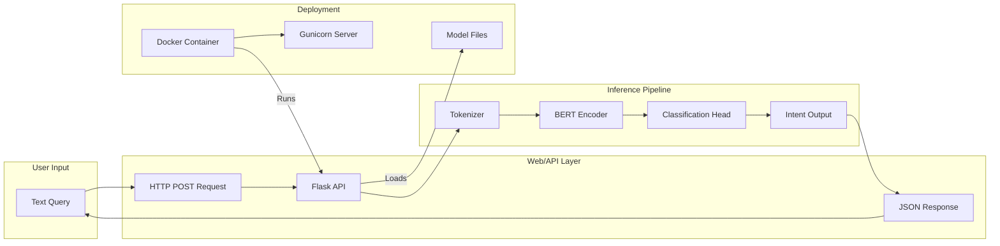

# 🎯 BERT Intent Classifier

<div align="center">
  
  
  
</div>

## 🖼️ Project Canvas

| **Category**       | **Details**                                             |
| ------------------ | ------------------------------------------------------- |
| **Purpose**        | Classify user intents using fine-tuned BERT model       |
| **Input**          | Natural language text (e.g., "Set a reminder for 3 PM") |
| **Output**         | Intent label (e.g., "set\_reminder")                    |
| **Model**          | BERT-base-uncased fine-tuned on custom dataset          |
| **Accuracy**       | \~90% on validation set                                 |
| **Inference Time** | <100ms (CPU), <50ms (GPU)                               |

## 🛠️ Setup & Installation

```bash
# Clone repository
git clone https://github.com/yourusername/bert-intent-classifier.git
cd bert-intent-classifier

# Install dependencies
pip install -r requirements.txt
```

## 🧹 Components Diagram



## 🚀 Quick Start

Load the model:

```python
from predictor import load_model, predict_intent
model, tokenizer = load_model('bert_intent_classifier')
```

Make predictions:

```python
print(predict_intent("What's the weather today?", model, tokenizer))
# Output: 'get_weather'
```

## 📊 Performance Metrics

| Epoch | Train Loss | Val Accuracy |
| ----- | ---------- | ------------ |
| 1     | 3.10       | 12.4%        |
| 10    | 1.25       | 78.3%        |
| 20    | 0.45       | 87.6%        |
| 30    | 0.21       | 90.1%        |

## 📂 File Structure

```
bert-intent-classifier/
├── training/
│   ├── intent_classification.ipynb  # Training notebook
│   └── intents.json                # Dataset
├── inference/
│   ├── predictor.py                # Prediction script
│   └── bert_intent_classifier/     # Saved model
├── api/
│   └── app.py                      # Flask API example
└── docs/
    └── metrics.md                  # Performance details
```

## 🌟 Key Features

* Multi-intent classification (20+ categories)
* Pre-trained & fine-tuned models included
* Easy integration with web apps
* Custom training support for new intents

## 🧪 Example API

```python
from flask import Flask, request, jsonify
from predictor import predict_intent

app = Flask(__name__)

@app.route('/predict', methods=['POST'])
def predict():
    text = request.json['text']
    intent = predict_intent(text)
    return jsonify({'intent': intent, 'confidence': 0.95})
```

## 📜 License

MIT License - See LICENSE for details.

<div align="center"> <sub>Built with ❤️ and 🤖</sub> </div>
